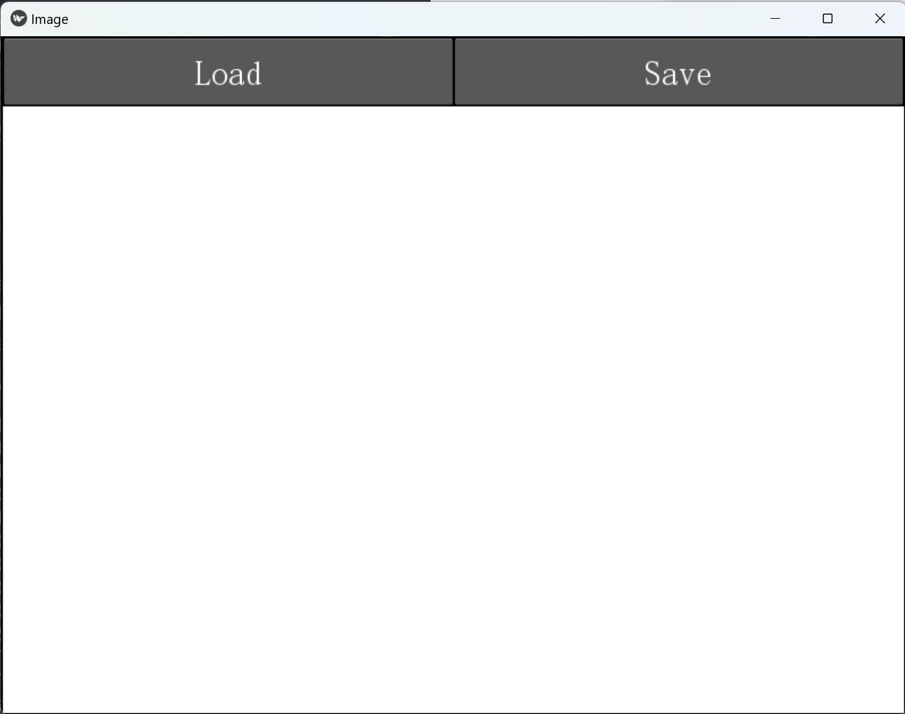
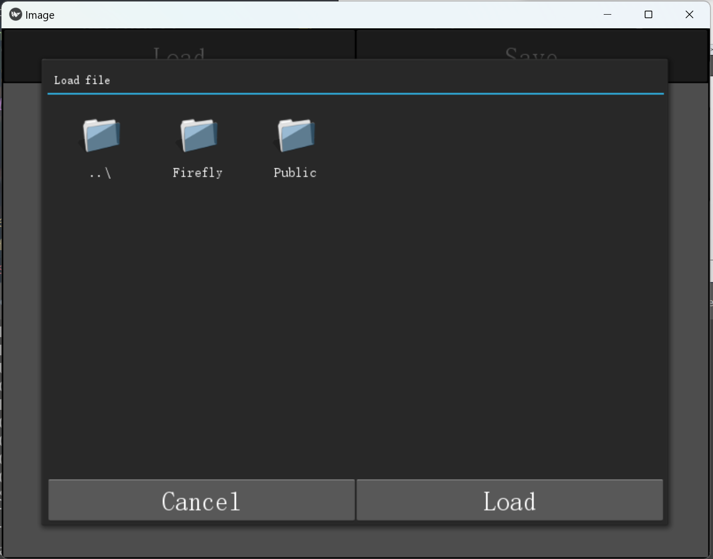
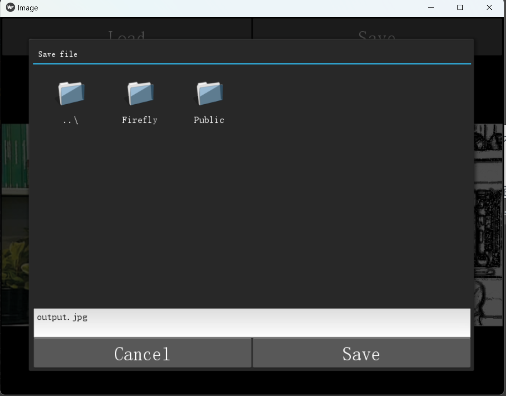

## 📜 使用说明

应用提供了Windows和安卓两个平台的安装包，用户界面均一致，这里以Windows平台的运行截图为例子进行使用说明。

### 主界面

窗口上部有两个功能按钮：

- <kbd>Load</kbd>

    导入需要进行处理的原图片

- <kbd>Save</kbd>

    将处理完的照片保存至指定位置

若照片处理完成，则主界面将显示处理前后的对比视图

### 导入照片的选择界面

点击主屏幕上部的 <kbd>Load</kbd> 按钮后，进入导入照片的选择界面

> 📝 初始的打开目录在不同的操作系统下会有所不同：
> - Windows: `C:\\Users`
> - 安卓：`/storage/emulated/0`。假如该路径不存在，则打开程序文件所在的目录

选中照片后，若要确认导入，则点击右下的 <kbd>Load</kbd> 按钮；若要取消导入，则点击左下的 <kbd>Cancel</kbd> 按钮

> ⚠️ 出于性能考量，建议导入的照片分辨率**不高于449*362**

### 保存照片的选择界面

点击主屏幕上部的 <kbd>Save</kbd> 按钮后，进入保存照片的选择界面

图片默认保存为 .jpg 格式，可以通过输入框进行重命名

